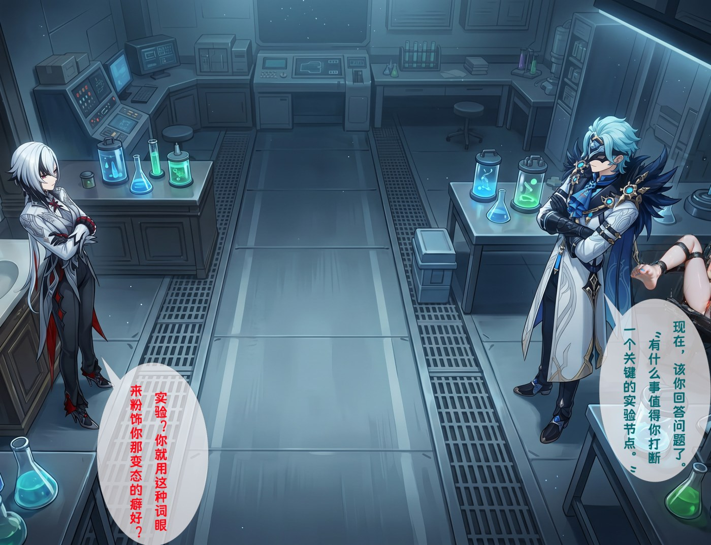
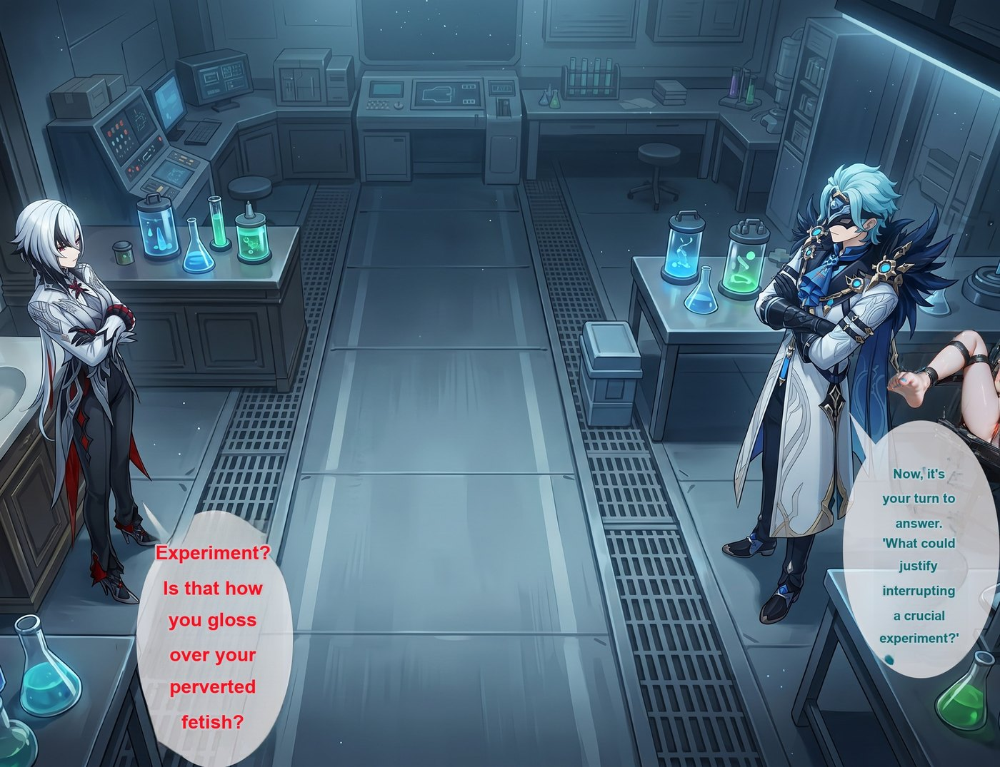
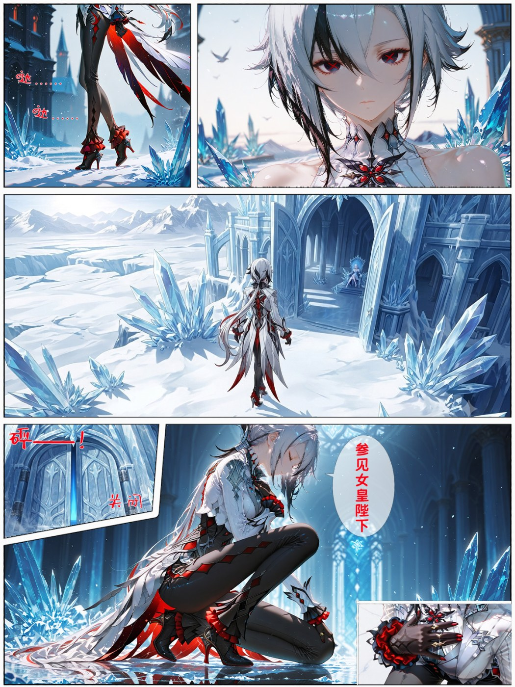
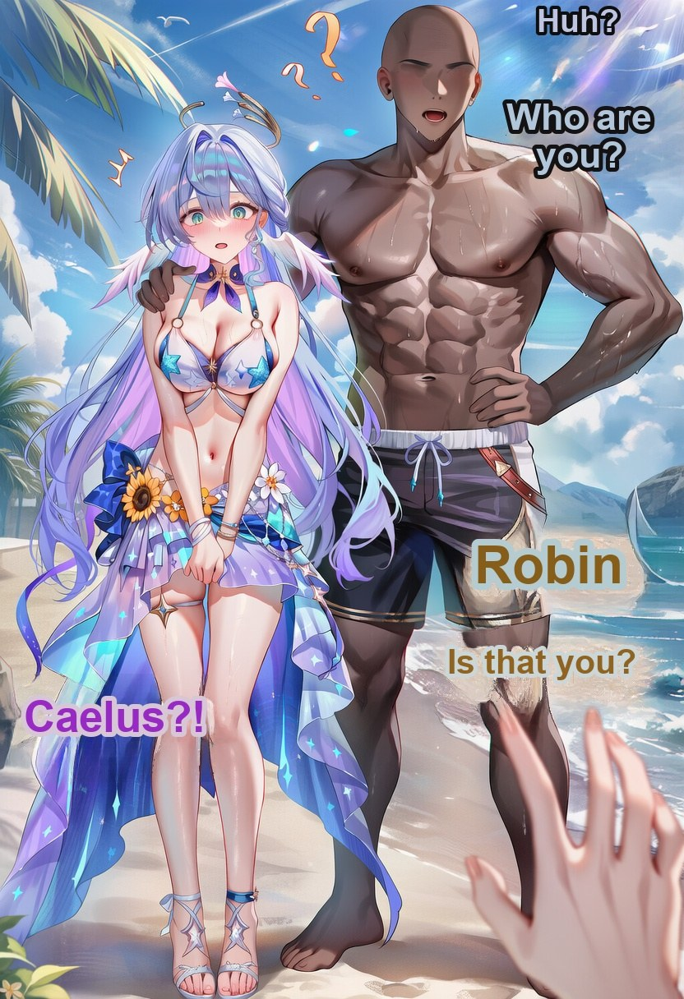
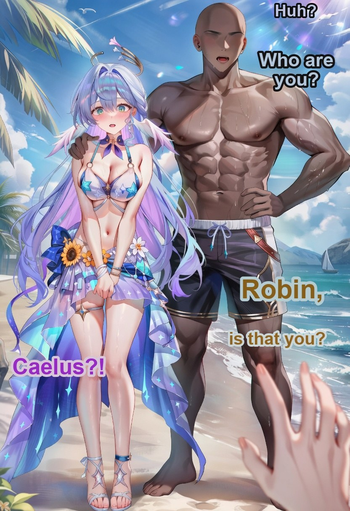
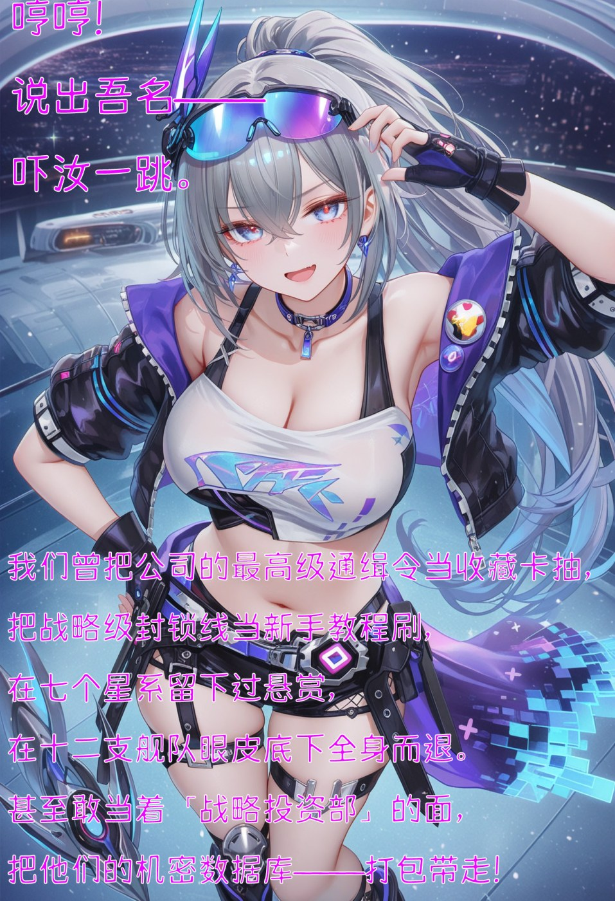
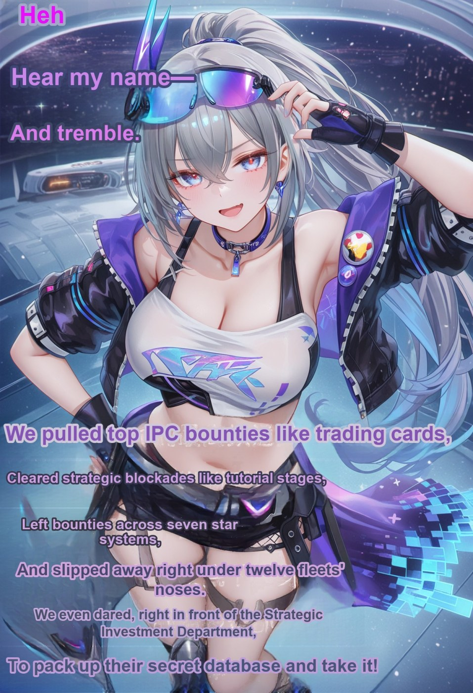
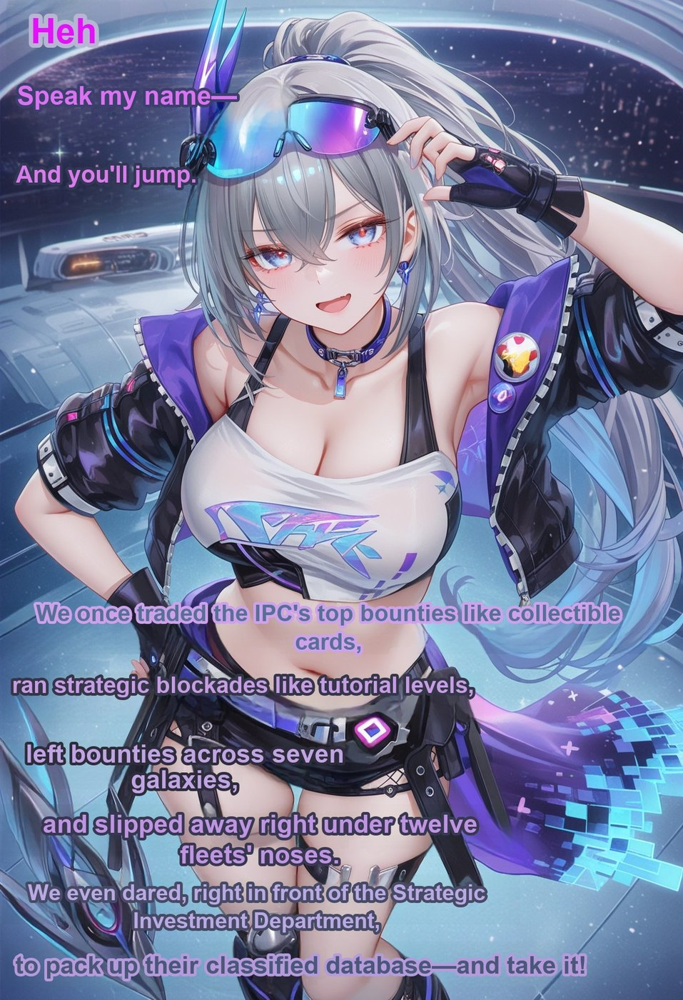
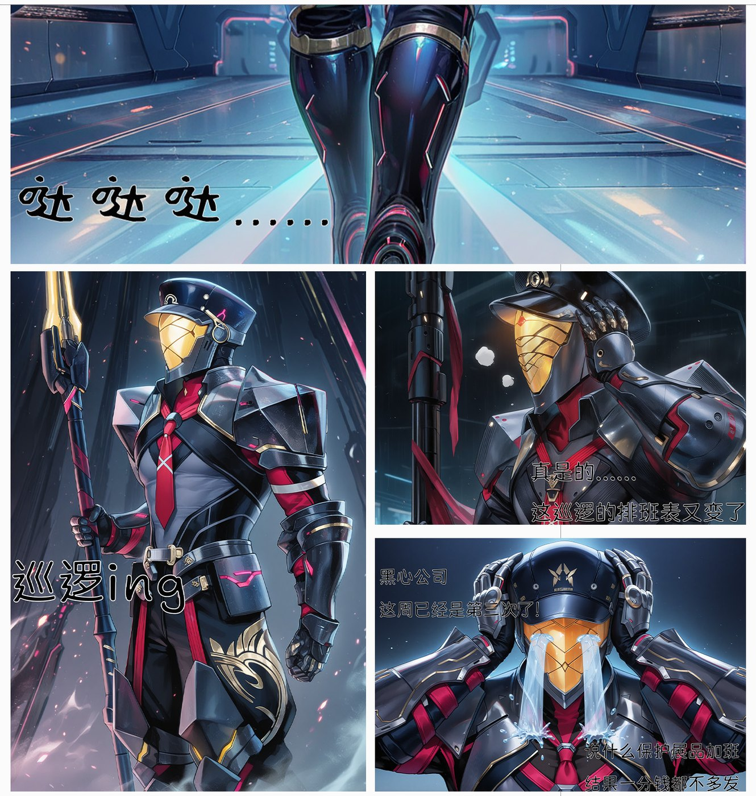
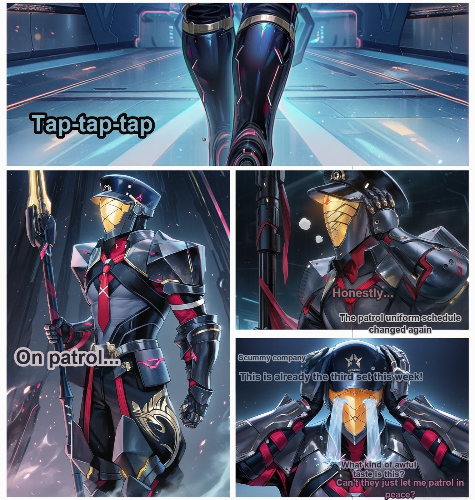

# illustration-lettering v0.8

插画 / 漫画 **中文配文 → 英文（或日文）嵌字** 管线。私有仓库。把带中文字幕的图丢进一个文件夹，即可批量出译文字幕图。

- **Mode B（推荐）**：你提供「无字底图」时，不跑擦字，只定位+翻译+把字打在底图上。脸和身体保持原像素。
- **Mode A**：只有带字原图时，云端 Vision 出框 → 本地 LaMa 擦中文 → 再嵌翻译。v0.7 加厚 overlay/SFX 掩膜并二次补擦，插画叠字已作为主路径锁定。

效果对照见 [`examples/`](examples/)。

---

## 一张图看懂：哪些必须本地，哪些可以上云

| 步骤 | 做什么 | 推荐 | NSFW 注意 |
|---|---|---|---|
| **定位 + 读中文** | 从图上找出每句中文和框 | **云端** Gemini 3.7 Flash（默认） | 只上传图片做**分析**，不生图。Google 若拒图，自动改走 ZenMux |
| **翻译** | 中文字符串 → 英文/日文 | **默认本地** Ollama `qwen3.8:27b-uncensored`；本机没有再走 Gemini 文本 | 不传图。`--translate gemini` 可强制云端；`--translate local` 本机没有就失败 |
| **擦字（仅 Mode A）** | 去掉原图中文 | **必须本地** manga-image-translator 的 LaMa | 不要用云端 image-edit 去抹 NSFW，会被审、还会改画 |
| **嵌字** | 把译文画回图上 | **本地代码**（Pillow） | 不经过任何云端 |
| **无字底图（Mode B）** | 你自己准备干净底板 | 人工 / 你现有的去字流程 | 本仓库不调用云端生图 |

**一句话**：Gemini 只负责看图定位；翻译默认本机 Qwen 无审查；擦字和写字都在你电脑上。

---

## 效果参考

对照图选自验收过的干净样本：无残字、无糊脸。完整金标准不进仓库。

### Mode A · 对话框铺满

原图（左）→ 擦字+嵌英文（右）。气泡里的英文会尽量铺满内腔。

| 原图 | Mode A |
|---|---|
|  |  |
|  |  |
|  |  |

### Mode A · 分镜漫画

| 原图 | Mode A |
|---|---|
|  |  |

### Mode B 能过、Mode A 会擦糊

同一张图：Mode A 只有带字原图，要本地 LaMa，腿/天可能擦糊。Mode B 用无字底图，不跑擦字，身体像素保持。

| 原图 | Mode A | Mode B（干净底图） |
|---|---|---|
|  |  |  |
|  |  |  |
|  |  |  |

有同名无字底板时请走 Mode B。

### Mode B · 叠字 / 分镜（干净样本）

| 带字原图 | Mode B 嵌字 |
|---|---|
|  |  |
|  |  |
|  |  |

---

## 拿到即用（最短路径）

### 0. 你需要的环境

- Windows + NVIDIA GPU（Mode A 擦字用 CUDA LaMa）
- 已经能跑 [manga-image-translator](https://github.com/zyddnys/manga-image-translator) 的 Python（本机常用 ComfyUI 自带解释器）
- 本机已下载 MIT 的 **LaMa / ComicTextDetector / 48px OCR** 权重（放在 MIT 仓库的 `models/` 下，按其文档来）

没有 GPU 时，仍可跑 **Mode B**（不擦字）。

### 1. 克隆

```bat
git clone git@github-cheerotter13-ai:cheerotter13-ai/illustration-lettering.git
cd illustration-lettering
```

若尚未配置该账号 SSH，把 `~/.ssh/config` 写成：

```
Host github-cheerotter13-ai
    HostName github.com
    User git
    IdentityFile C:/Users/ROG/.ssh/id_ed25519_cheerotter13_ai_codex
    IdentitiesOnly yes
```

HTTPS 也行：`https://github.com/cheerotter13-ai/illustration-lettering.git`（私有仓库，用有权限的账号登录）。

### 2. Python 依赖

优先用你跑 ComfyUI / MIT 的那个 `python.exe`，不要用系统 Python。

```bat
python -m pip install -r requirements.txt
```

确认能 `import torch` 且 `torch.cuda.is_available()` 为 True（Mode A）。

设置 MIT 根目录（克隆位置）：

```bat
set MIT_ROOT=D:\manga-image-translator
```

或写进 `.env`（见下一步）。

### 3. 配置密钥（不要把 key 写进仓库）

```bat
copy .env.example .env
```

用记事本打开 `.env`：

```
GEMINI_API_KEY=你的_Google_AI_Studio_Key
ZENMUX_API_KEY=你的_ZenMux_Key
MIT_ROOT=D:\manga-image-translator
```

也可以不建 `.env`，改成环境变量，或把 Google key 单独放到本目录的 `.gemini_ai_studio_key`（一行、无引号）。这三类文件都已在 `.gitignore`。

**Google AI Studio**

1. 打开 https://aistudio.google.com/apikey
2. 创建 API key
3. 填入 `GEMINI_API_KEY`

定位用 `gemini-3.7-flash`。503 / 429 / 内容拦截时自动改 ZenMux，不必你改命令。翻译默认不走这个 key（走本机 Qwen）。

**ZenMux（备用）**

1. 打开 https://zenmux.ai 建 key
2. 填入 `ZENMUX_API_KEY`

走的模型名默认 `google/gemini-3.7-flash`（可用 `VISION_MODEL` 覆盖）。

两边都不要提交、不要贴进 Issue / README。

### 4. 准备图片

```
my-job/
  lettered/     ← 带中文的原图，jpg/png
  clean/        ← （可选）同名无字底图，Mode B 才需要
  out/          ← 输出，脚本会创建
```

`lettered/foo.jpg` 和 `clean/foo.jpg` **文件名必须一致**，分辨率尽量 1:1。

### 5. 运行

Mode B（有底图，推荐）：

```bat
python letter.py --retranslate --lang en --src my-job\lettered --clean my-job\clean --dst my-job\out
```

Mode A（只有带字原图）：

```bat
python letter.py --retranslate --lang en --src my-job\lettered --dst my-job\out
```

日文：

```bat
python letter.py --retranslate --lang ja --src my-job\lettered --dst my-job\out
```

只跑某几张：

```bat
python letter.py --retranslate --lang en --src my-job\lettered --dst my-job\out --only 99.jpg "0 (1).jpg"
```

跑完看 `out\` 和 `logs\qingge_en.jsonl`。

---

## 命令一览

| 参数 | 含义 |
|---|---|
| `--src DIR` | 带中文原图目录 |
| `--dst DIR` | 输出目录 |
| `--clean DIR` | 同名无字底图 → **Mode B**，跳过 LaMa |
| `--translate auto\|local\|gemini` | 翻译后端。默认 `auto`：本机 Qwen，没有再 Gemini |
| `--no-prefilter` | 每张都送给 Gemini 定位（默认会跳过无字幕图） |
| `--retranslate` | 忽略缓存，重新翻译 |
| `--lang en\|ja` | 目标语言 |
| `--only a.jpg b.jpg` | 只处理这些文件名 |
| `--mit-root DIR` | manga-image-translator 根目录 |
| `--names names.json` | 角色名表 |

定位固定走 Gemini。旧的本地 CTD+OCR 读字路径已去掉。`--vision` 仍可写，但会被忽略。

---

## 本地模型（NSFW 相关）

### 必须本地：擦字 LaMa（Mode A）

- 来源：manga-image-translator 里的 `LamaLargeInpainter`
- 为什么本地：云端改图会改画、缩分辨率，明确 NSFW 还会直接拒
- GPU：默认 `cuda`，权重由 MIT 自己管理（按其 README 放到 `models/`）

### 默认本地：翻译（Ollama Qwen）

- 地址：`http://127.0.0.1:11434/api/chat`
- 模型：`qwen3.8:27b-uncensored`（可用环境变量 `OLLAMA_MODEL` / `OLLAMA_HOST` 改）
- 本机没开 Ollama 时，`auto` 会改走 Gemini 文本翻译，本进程不再试本地

### 预过滤：ComicTextDetector

- 用来判断图上有没有字幕，避免空图上传 Gemini
- `--no-prefilter` 关闭

### 字体（本地）

| 语言 | 脚本会按顺序找 |
|---|---|
| 英文 | `arialbd.ttf` → `msyhbd.ttc` → `arial.ttf` |
| 日文 | `YuGothB.ttc` → `msyhbd.ttc` → `msgothic.ttc` |

Windows 默认就有。缺字体时把 TTF 放进系统 Fonts，或改 `letter.py` 里的 `FONT_PATHS`。

---

## 云端模型

### 定位（看图出 JSON）

- 模型：`gemini-3.7-flash`
- 输入：整张 JPEG + 固定 prompt（只要框和原文，不生图）
- 输出：`[{text, type: bubble\|overlay\|sfx, box: [ymin,xmin,ymax,xmax]}]`，坐标 0–1000
- 顺序：Google AI Studio → 失败再 ZenMux
- Google 连续 503/429 两次后，**本进程剩下的图直接走 ZenMux**，避免每张空转

### 翻译（纯文本）

- 同一套 Gemini 3.7 Flash
- 输入：中文字符串数组 + 角色名表
- 输出：等长英文/日文数组
- 同样 Google 优先、ZenMux 备用

### 明确不会走云端的

- 擦字 / inpaint
- 嵌字渲染
- 无字底图生成（请你自己准备 Mode B 的 `clean/`）

---

## 配置文件

### `.env`

从 `.env.example` 复制。脚本启动时自动 `load_dotenv`。

### `names.json`

角色官方译名。已带一份原神 / 星铁常用表。按需改：

```json
{
  "names": [
    {"zh": ["银狼"], "en": "Silver Wolf", "ja": "銀狼"}
  ]
}
```

`LETTER_NAMES` 或 `--names` 可指向别的表。

### 密钥查找顺序

Google：

1. 环境变量 `GEMINI_API_KEY` / `GOOGLE_API_KEY` / `GOOGLE_AI_STUDIO_API_KEY`
2. 仓库目录 `.gemini_ai_studio_key`

ZenMux：

1. 环境变量 `ZENMUX_API_KEY`

---

## Mode A / Mode B 怎么选

| 你有什么 | 用什么 |
|---|---|
| 只有带中文的图 | Mode A：`--src` `--dst` |
| 另有同名无字底图 | Mode B：再加上 `--clean` |
| 大白对话框、要最干净 | 尽量 Mode B；Mode A 会 LaMa 填洞，偶发发脏或残字 |
| 插画叠字（字打在画上） | Mode A 已经可用；Mode B 仍然更稳 |

---

## 已知限制（v0.8）

- 大号 SFX 整框擦字可能在天空/身体上留下污块（如「咿呀」类）。
- 贴在皮肤上的 overlay 偶发轻糊，比叠中文可接受。
- 贴在亮背景上的细长椭圆，英文可能偏小。
- Google AI Studio 免费档经常 503，备用 ZenMux 是正常路径，不是失败。

---

## 目录结构

```
illustration-lettering/
  letter.py              主入口
  vision_locate.py       Gemini 定位 / 翻译路由
  names.json             角色名表
  requirements.txt
  .env.example
  examples/              SFW 对照图
  VERSION                0.8.0
```

运行时自己出现、不要提交：

```
.env
.gemini_ai_studio_key
logs/
output/
```

---

## 版本

**v0.8.0** — 2026-08-29

- 定位默认且仅用 Gemini；去掉本地 CTD+OCR 读字主路径
- 翻译默认本机 Qwen 无审查，Ollama 不可用再 Gemini（`--translate auto|local|gemini`）
- 预过滤默认开启

**v0.7.1** — 2026-08-29

- 用 v0.7 管线重出 README Mode A / Mode B 对照图

**v0.7.0** — 2026-08-29

- 锁定 Mode A+Vision 为主擦字路径（无底图叠字）
- overlay/SFX 掩膜吃描边；小面积 SFX 可整框
- LaMa 后最多两轮补擦
- 嵌字 skip 仅当掩膜漏检且擦完仍像原文笔画
- `--skip-done` 只认 jsonl 最后状态，且 dest 不能是源图拷贝
- 定位也框已写在画上的英文时间戳/标题；场景霓虹仍跳过

**v0.6.0** — 2026-08-29

- 主路径：Gemini 3.7 Flash 定位+翻译，代码嵌字
- Google AI Studio 优先，ZenMux 备用
- Mode B 跳过 LaMa；Mode A 本地 LaMa
- 对话框英文铺满内腔
- 不再使用 DeepSeek 做定位
